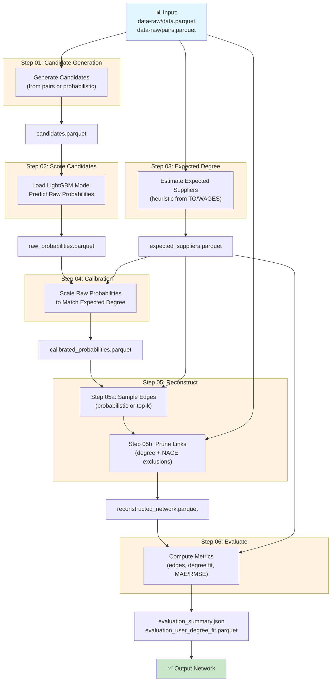

# AIML4OS_WP11_reconstruction

Given a set of enterprises, their properties, a link prediction function, 
derive a network of enterprises.

**WORK IN PROGRESS / IN HIGH FLUX**



## Run the Pipeline

Input data is read from `data-raw/`:

- `data-raw/data.parquet` (enterprise properties)
- `data-raw/pairs.parquet` (candidate pairs; preferred when available)

Run end-to-end:

```bash
python main.py
```

### Reconstruction Modes

Two reconstruction modes are available:

- `probabilistic` (default): weighted sampling without replacement.
- `topk`: deterministic top-k selection per user for reproducibility baselines.

Examples:

```bash
# Default probabilistic mode
python main.py --selection-mode probabilistic

# Deterministic baseline
python main.py --selection-mode topk
```

### Optional NACE Exclusions

Cross-sector links are allowed by default. You can optionally exclude specific user-NACE -> supplier-NACE combinations.

Template file:

- `data-raw/nace_exclusions.csv`

Expected columns:

- `user_nace`
- `supplier_nace`

Run with exclusions:

```bash
python main.py \
	--selection-mode probabilistic \
	--nace-exclusions data-raw/nace_exclusions.csv
```

### Outputs

Pipeline outputs are written to `data/`:

- `candidates.parquet`
- `raw_probabilities.parquet`
- `expected_suppliers.parquet`
- `calibrated_probabilities.parquet`
- `sampled_edges.parquet`
- `reconstructed_network.parquet`
- `evaluation_summary.json`
- `evaluation_user_degree_fit.parquet`

## Workflow Management with Snakemake

A `Snakefile` is provided for reproducible workflow orchestration. All pipeline steps are tracked as Snakemake rules with automatic dependency resolution.

### Installation

Install Snakemake (optional, if not already in your environment):

```bash
pip install snakemake
```

### Running with Snakemake

Default run (probabilistic mode):

```bash
snakemake --cores 1
```

Run with deterministic top-k baseline:

```bash
snakemake --cores 1 --config selection_mode=topk
```

Run with NACE exclusions:

```bash
snakemake --cores 1 --config nace_exclusions=data-raw/nace_exclusions.csv
```

Dry-run to visualize DAG:

```bash
snakemake -n --cores 1
```

### Configuration

Edit `config.yaml` to set defaults, or override individual settings at the command line:

```bash
snakemake --cores 1 \
  --config selection_mode=topk random_state=123 max_suppliers_per_user=30
```

Available config keys:

- `python`: Path to Python interpreter (default: `.venv/bin/python`)
- `data_raw_dir`: Input directory (default: `data-raw`)
- `data_dir`: Output directory (default: `data`)
- `model`: Path to LightGBM model (default: `models/model_LightGBM.pkl`)
- `selection_mode`: Reconstruction mode (default: `probabilistic`; options: `probabilistic`, `topk`)
- `nace_exclusions`: Path to NACE exclusion file (default: `""` disabled)
- `random_state`: Random seed (default: `42`)
- `max_suppliers_per_user`: Max outgoing degree (default: `25`)
- `max_users_per_supplier`: Max incoming degree (default: `500`)
